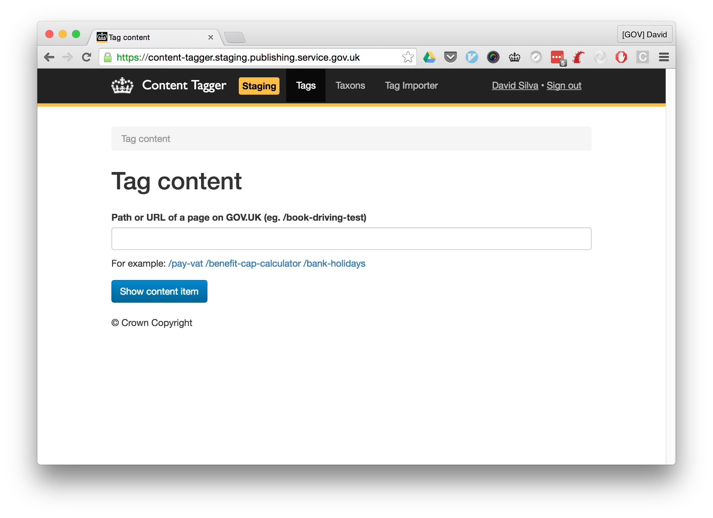
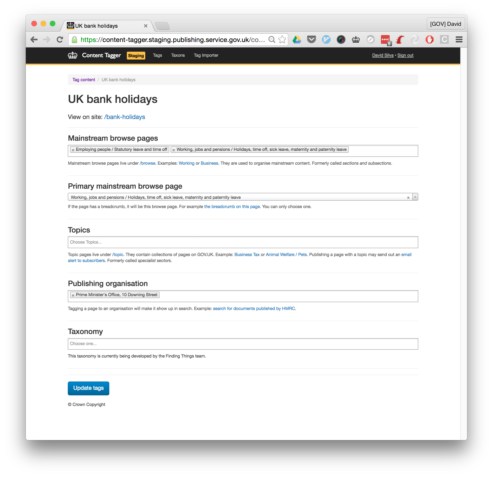
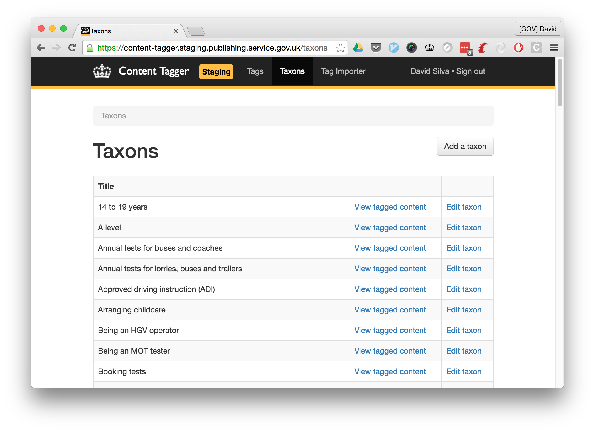
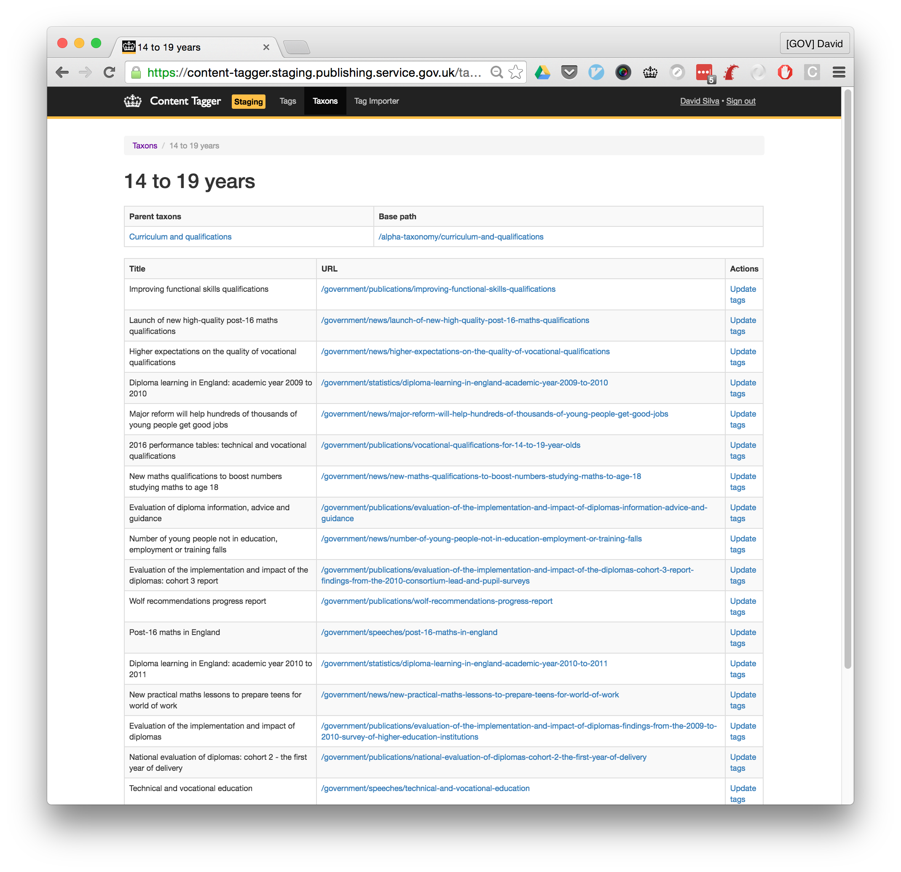
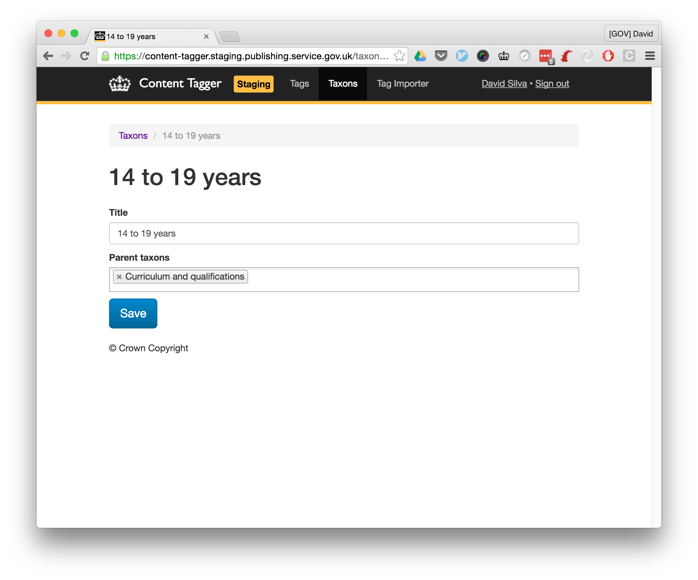

# Content Tagger

Its main purpose is to provide an interface that allows content to be tagged and bulk-tagged.
It also provides an interface for adding and updating taxons.

## Technical documentation

This is a Ruby on Rails application.
It interacts with the publishing-api to manage the "links hash" for content on GOV.UK.
It also allows the creation of new taxons, updating taxons and bulk-tagging.

### Permissions

Users need to have either the `GDS Editor` or the `Tagathon participant` permission to access
this application.

 - **GDS Editor** users will have full unrestricted access to the GOV.UK taxonomy and navigation tools
 - **Tagathon participant** users have restricted access to the Tagathon Project bulk tagger and analytics tools

### Running the application locally

For the purposes of local development, it's easiest to run this in a Rails console locally to give yourself admin access to the application.

```
User.first.update permissions: ["signin", "GDS Editor"]
```

## Features

### Bulk Tagging

The bulk tagging feature allows us to search for existing content items via
their collections, and apply taxon links in bulk to them.

Please note that the search functionality has some restrictions. When a user
searches for a collection, if the search is too broad, we will only show the top
20 results on the search page. Currently, we do not paginate through the search
results. Instead, we ask the user to be more specific in the search query in
order to find the collection they are looking for.

### Tagging taxons to associated taxons

When adding or editing a taxon, it is possible to associate it with other taxons.
These associated taxons are stored in the links hash of a taxon's content item,
and can be used to pull in associated content from other taxons.

## Screenshots







### Dependencies

- [alphagov/publishing-api](https://github.com/alphagov/publishing-api) - used to publish links

### Running the application

```
$ bowl content-tagger
```

If you're using the VM, the app should appear on [http://content-tagger.dev.gov.uk/](http://content-tagger.dev.gov.uk/).

### Running the test suite

```
$ bundle exec rspec
```

## Licence

[MIT License](LICENCE)
