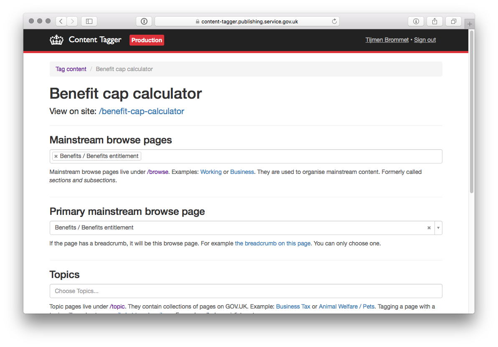
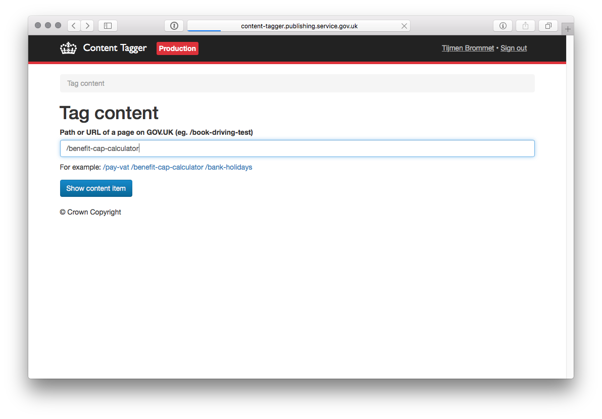

# Content Tagger

App for tagging content on GOV.UK.

## Screenshots




## Technical documentation

This is a Ruby on Rails application that works with the publishing-api to manage the "links hash" for content on GOV.UK. It also contains code for importing the "alpha taxonomy" - a new taxonomy for GOV.UK currently under development. This is done with a [series of rake tasks](lib/tasks/taxonomy.rake).

### Dependencies

- [alphagov/publishing-api](https://github.com/alphagov/publishing-api) - used to publish links

### Running the application

```
$ bowl content-tagger
```

If you're using the VM, the app should appear on [http://content-tagger.dev.gov.uk/](http://content-tagger.dev.gov.uk/).

### Running the test suite

```
$ bundle exec rspec
```

## Licence

[MIT License](LICENCE)
