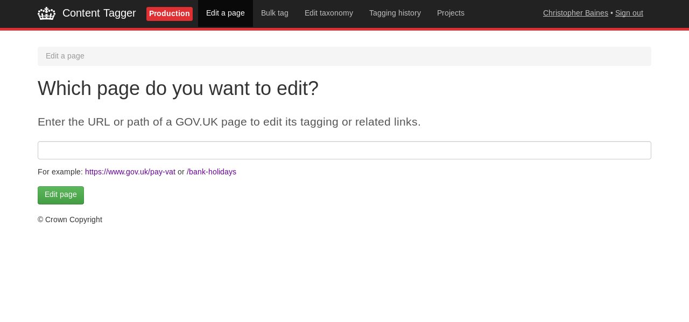
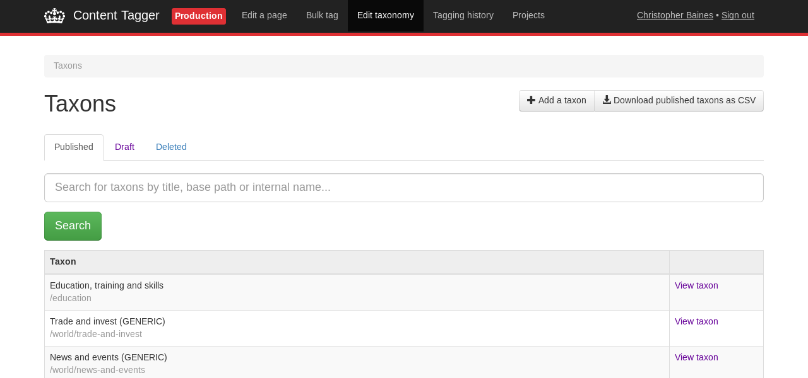
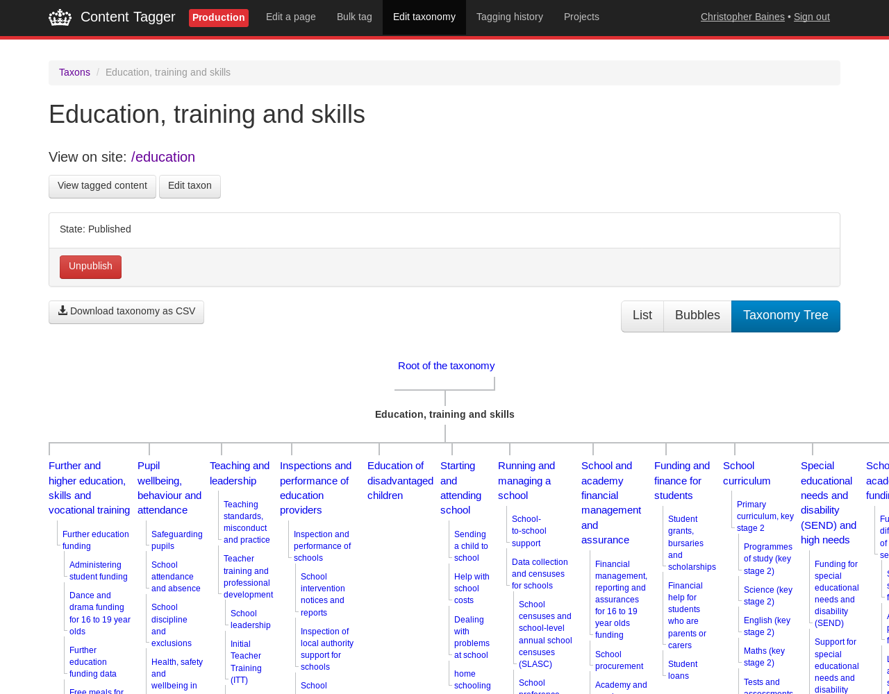
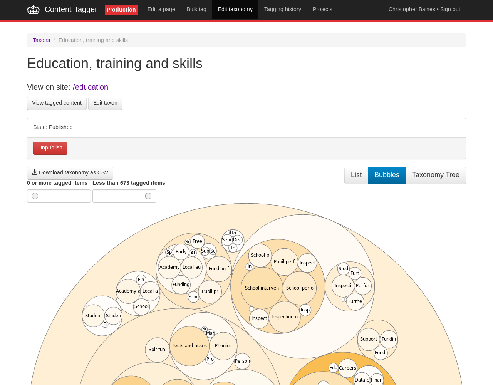
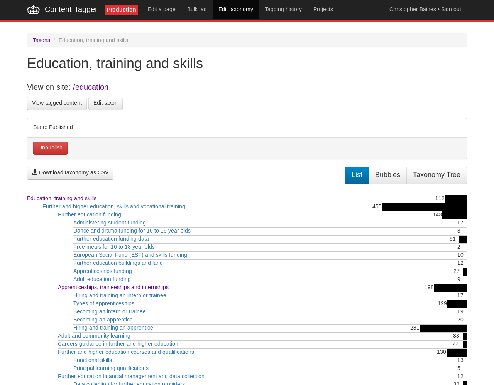
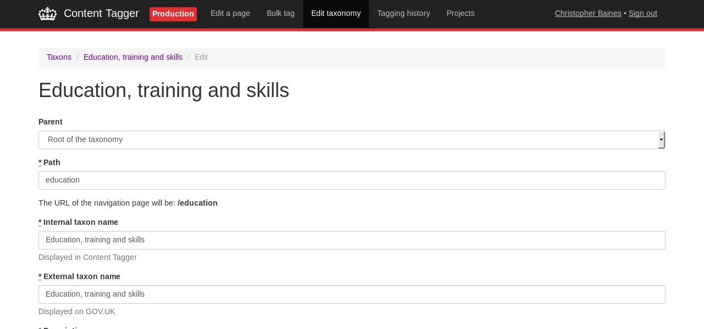
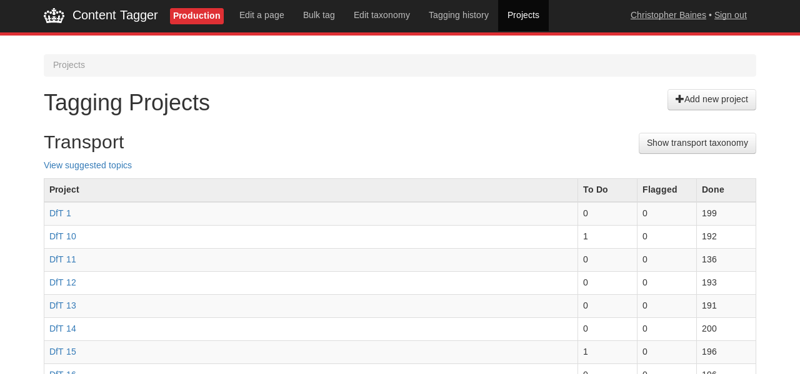

# Content Tagger

Content Tagger is the publishing application for the Topic Taxonomy on
GOV.UK. It also provides some functionality for tagging content in
bulk.

## Technical documentation

This is a Ruby on Rails application. It stores some data in a
PostgreSQL database, but for managing taxons and tagging content, it
interacts with the Publishing API.

### Permissions

Users need to have either the `GDS Editor` or the `Tagathon
participant` permission to access this application.

 - **GDS Editor** users will have full unrestricted access to the
   GOV.UK taxonomy and navigation tools
 - **Tagathon participant** users have restricted access to the
   Tagathon Project bulk tagger and analytics tools

### Running the application locally

For the purposes of local development, it's easiest to run this in a
Rails console locally to give yourself admin access to the
application.

```
User.first.update permissions: ["signin", "GDS Editor"]
```

### Running the test suite

```
$ bundle exec rspec
```

## Features

### Managing the Topic Taxonomy

Content Tagger can create, edit and unpublish taxons. It also can view
the content tagged to a taxon, and how this has changed over time.

Read [How the topic taxonomy works](https://docs.publishing.service.gov.uk/manual/taxonomy.html).

### Tagging content

Content Tagger has a "Projects" function for tagging content in bulk
to the Topic Taxonomy. It also supports tagging individual pages.

### Facets

Content tagger can create, edit and publish facet groups. It also allows
you to tag content to a facet group.

Content designers follow the [How to tag content with facet values](https://docs.publishing.service.gov.uk/manual/tag-content-with-facet-values.html)
instructions to tag a particular piece of content (e.g.
"/government/publications/workplace-rights-if-theres-no-brexit-deal") with a
particular facet value (e.g. "Accommodation").

## Screenshots

### Tagging content



### Taxons



### Education taxon



### Bubbles visualisation



### List visualisation



### Editing a taxon



### Tagging projects



## Dependencies

- [alphagov/publishing-api](https://github.com/alphagov/publishing-api)

## Licence

[MIT License](LICENCE)
