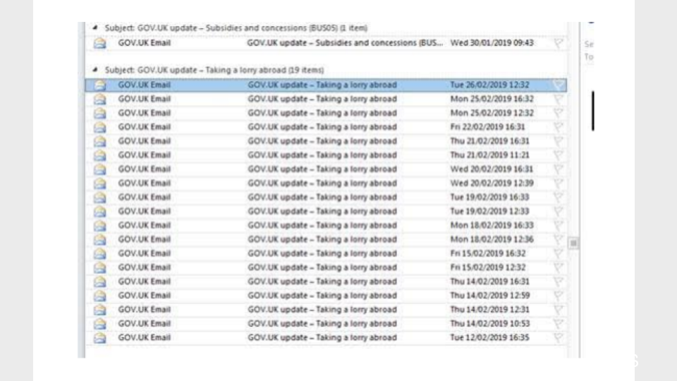

# Tagging content from multiple publishers to a facet

Date: 2019-06-26

## Context

In late 2018, the [business finder](https://www.gov.uk/find-eu-exit-guidance-business) was added to GOV.UK.
This finder was different to the others for two reasons:

1. It filtered on content published by multiple publishing apps.
2. It had customised logic between the facets. The results between the first two facets were "subtractive", like a normal finder,
but the results between the rest of the facets was "additive". Though this has since been changed to have an "additive" relationship between all of the facets.

Normally facets are defined in the "details" hash of the content item. "details" are updated every time the content item is published via the "put_content" method in publishing-api. After being published, the content item is reindexed in search with this facet information.

This meant that to be able to tag content to facets in the business finder, an interface would need to be added to every publishing app.

The quick solution to this problem was to bypass the publishing pipeline completely, and instead update the facet information in search directly.

Simply put, content designers would update a CSV file with a list of content and the business finder facets it needed to be tagged to. Developers would upload this CSV file and then run a script to tag the content in search.
The script would check whether it already knew about the tags, and if it didn't, would add them. It also triggered an email every time a new item of content was added to the business finder.

This manual process was run twice each day.

### The problem

Content items aren't just re-published when they're updated, but also when the things they are linked to are updated, e.g. an organisation, step by step or taxon.

As mentioned before, when content is updated, it is reindexed in search. That means that any business finder related tags are over written ("fall off" the search index) until the script is run again and they are re-added.
This means that in the time between the content being updated and the script being run, the content does not appear in the finder.

Another more serious problem was that, because an email is triggered every time a new item of content was added to the business finder, you could (and did) end up in a situation where it looked like a piece of content was being updated twice a day, when in reality only the tags, or related content was being updated.
An example of this was [Taking a lorry abroad](https://www.gov.uk/taking-a-lorry-abroad)



## Decision

To solve the problem of facets "falling off" the search index and duplicate emails being sent, the decision was to move tagging of content to business finder facets into the publishing pipeline.

To move the tagging to the publishing pipeline, these facets would have to be added to the content item somewhere. Putting them in the "details" wasn't viable, because either:

1. An interface would have to be added to every publishing app to tag to the finder or
2. If a separate app was used for tagging, any changes would have to be synchronised with the main publishing app. This wouldn't work in most applications as the different editions of the content are stored in the local database.

The solution was to add the facets to the "links" hash of the content item, and do the tagging in a central location like content-tagger.

The benefits to this approach are:

1. The "links" hash is updated using a separate "patch_links" endpoint on the publishing-api.
2. The publishing-api is the source of truth for "links", so it's an accepted pattern to get the existing links from the publishing-api before updating them.
3. The topic taxonomy had already established a pattern for tagging content outside of the publishing-app.
4. Limited user access to content-tagger means that content designers would be able to continue reviewing the tagging requests.

There are also some cons:

1. finder-frontend would need major changes to be able to read facets from "details" as well as "links".
2. In the majority of cases, content will only be tagged to the finder after it's been published. This means that any users subscribed to the finder will miss these updates. This was eventually resolved by giving content designers the option of triggering an email alert from the user interface when the content is tagged.

## Status
Accepted

## Consequences

As the "links" hash contains lists of content items, the facets had to be defined that way too.

Three new types of content item were created to store facets:

```
links: {
   facet_groups: [
      facets: [
         facet_values: []
      ]
  ]
}
```

"facets" are things like "case type" and can have many facet_values. A facet_group allows facets like "case type" to be defined multiple times and each one can contain different lists of facet_values. The idea is that a finder only filters on the facets from one facet_group.

However the facets themselves aren't added to the content item:

```
links: {
  facet_groups: []
  facet_values: []
}
```

At the moment finder-frontend doesn't try to replicate the nested structure of the facets. It just sends a list of content_ids of the selected facet_values and complies them into one `filter_facet_values` request param. This request is translated into an "OR" query by search-api and returns results that match any of the facet_values. This is fine for the business finder which wants an "additive" list of results, but will need to be revisited if this links-based facets pattern is to be used by other finders.
